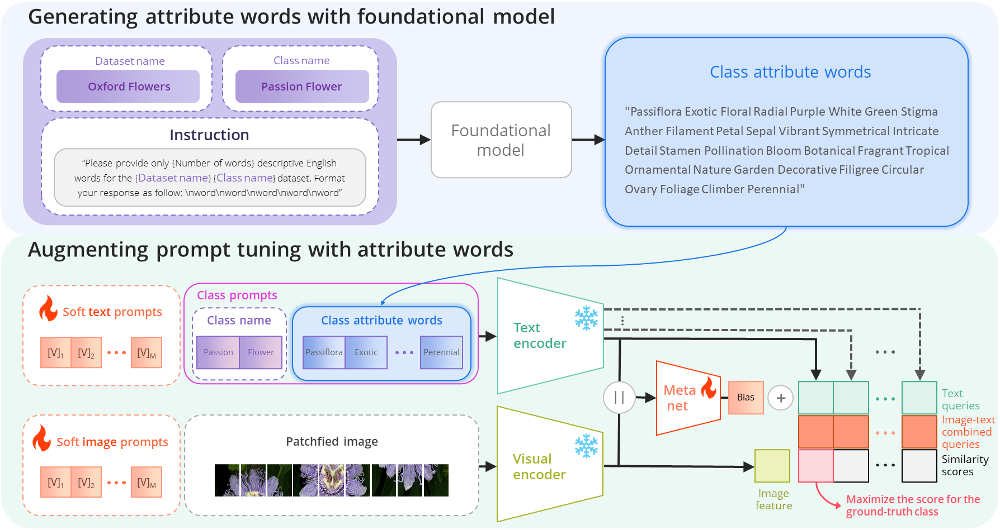
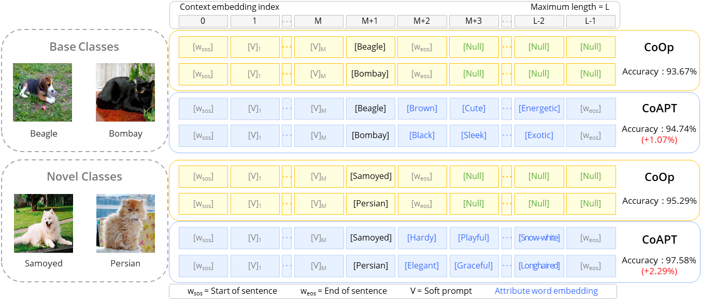
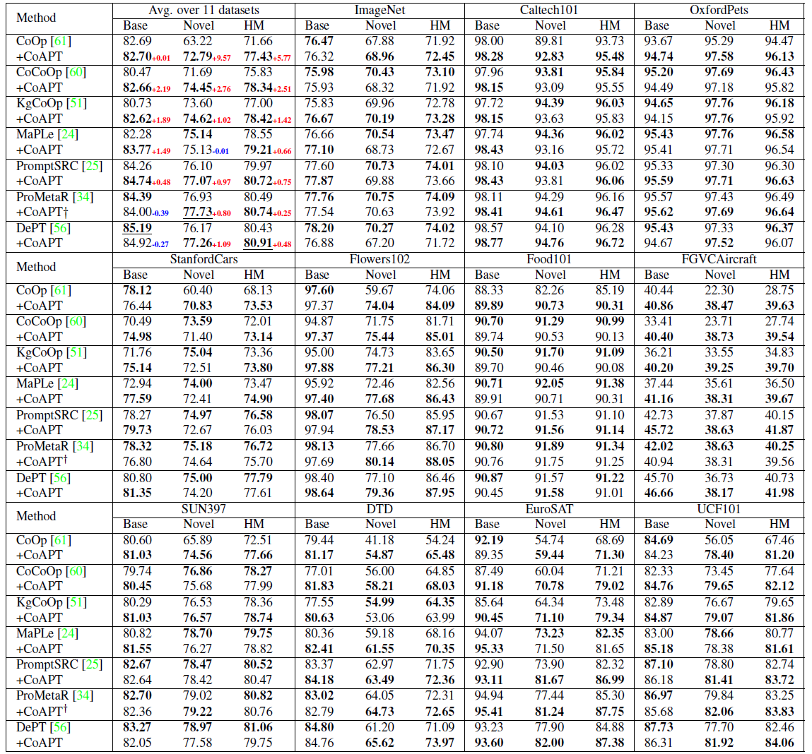
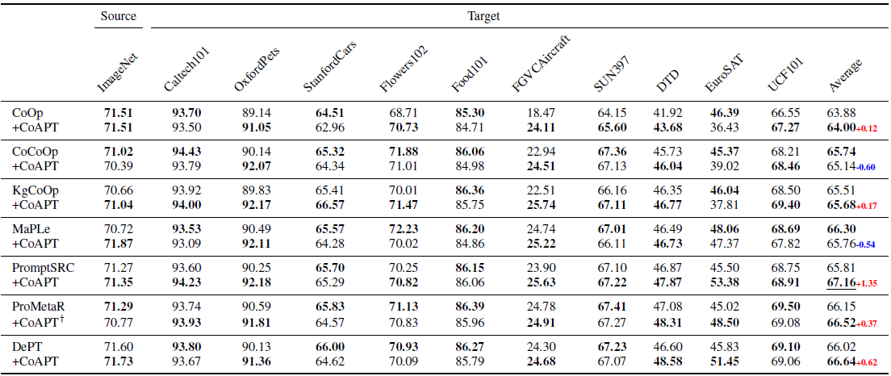
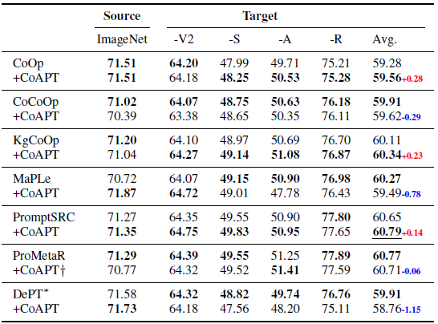

# CoAPT
CoAPT

----

# Highlights

> **Abstract** We propose a novel prompt tuning method called CoAPT (Context Attribute words in Prompt Tuning) for few/zero-shot image classification. 
The core motivation is that attributes are descriptive words with rich information about a given concept.
Thus, we aim to enrich text queries of existing prompt tuning methods, improving alignment between text and image embeddings in CLIP embedding space.
To do so, CoAPT integrates attribute words as additional prompts within learnable prompt tuning and can be easily incorporated into various existing prompt tuning methods.
To facilitate the incorporation of attributes into text embeddings and the alignment with image embeddings, soft prompts are trained together with an additional meta-network that generates input-image-wise feature biases from the concatenated feature encodings of the image-text combined queries.
Our experiments demonstrate that CoAPT leads to considerable improvements for existing baseline methods on several few/zero-shot image classification tasks, including base-to-novel generalization, cross-dataset transfer, and domain generalization. 
Our findings highlight the importance of combining hard and soft prompts and pave the way for future research on the interplay between text and image latent spaces in pre-trained models.



----

# Main Contributions

> 1. CoAPT is simple, easy to implement, and can be integrated with many existing prompt tuning methods.
> 2. CoAPT demonstrates consistent empirical improvement upon baselines across base-to-novel generalization, cross-dataset evaluation and domain generalization tasks.
> 3. We present comprehensive ablative evaluations and analysis of different variations of CoAPT, with emphasis on the process and configurations for generating relevant hard prompts.

----

# Flexibility and Effectiveness

Our CoAPT model utilizes the entire text encoder input and integrates an additional meta-network, resulting in considerable performance improvements.

<div align="center">
  
</div>

**Base-to-New Generalization Performance**



**Cross-Dataset Transfer Performance**



**Domain Generalization Performance**

<div align="center">
  
</div>

# Installation

This codebase is tested on Ubuntu 20.04.2 LTS with python 3.8. Follow the below steps to create environment and install dependencies.

Setup conda environment (recommended).

**Create a conda environment**

```
conda create -y -n coapt python=3.8
conda activate dept
```

**Install torch (requires version >= 1.8.1) and torchvision**

```
pip install torch==1.9.0+cu111 torchvision==0.10.0+cu111 torchaudio==0.9.0 -f https://download.pytorch.org/whl/torch_stable.html
```

**Install dassl**

```
git clone https://github.com/KaiyangZhou/Dassl.pytorch.git
cd Dassl.pytorch/
pip install -r requirements.txt
python setup.py develop
```

**Install CoAPT**

```
cd ..

git clone https://github.com/leegun4488/coapt.git
cd DePT/

pip install -r requirements.txt
pip install setuptools==59.5.0
```

----

# Data preparation

Please follow the instructions at [DATASETS.md](datasets/DATASETS.md) to prepare all datasets.

----

# Training and Evaluation

We provide parallel running script `parallel_runner.py` for each prompting variant including CoOp (w/ CoAPT), CoCoOp (w/ CoAPT), KgCoOp (w/ CoAPT), MaPLe (w/ CoAPT), PromptSRC (w/ CoAPT), DePT (w/ CoAPT). Make sure to configure the dataset paths in environment variable DATA and run the commands from the main directory.

**Base to New Generalization**

```
# Running CoOp (w/ CoAPT)
python parallel_runner.py --cfg coop
python parallel_runner.py --cfg coop_coapt

# Running CoCoOp (w/ CoAPT)
python parallel_runner.py --cfg cocoop
python parallel_runner.py --cfg cocoop_coapt

# Running KgCoOp (w/ CoAPT)
python parallel_runner.py --cfg kgcoop
python parallel_runner.py --cfg kgcoop_coapt

# Running MaPLe (w/ CoAPT)
python parallel_runner.py --cfg maple
python parallel_runner.py --cfg maple_coapt

# Running PromptSRC (w/ CoAPT)
python parallel_runner.py --cfg promptsrc
python parallel_runner.py --cfg promptsrc_coapt

# Running DePT (w/ CoAPT)
python parallel_runner.py --cfg dept
python parallel_runner.py --cfg dept_coapt
```

After running, the output will be in the `outputs/` directory, the results will be tallied in the `results/` directory as csv, and a mail will be sent to email address.

If you want to add your own models, you'll need to write your models in the `trainers/` directory and register them in dassl, then configure the settings in the `configs/` directory and `train.py` file, and add your new tasks to the `configs.py` file. Then you can run `python parallel_runner.py --cfg your_model` to run our own model.

----

# Acknowledgements

Our code is based on [CoOp, CoCoOp](https://github.com/KaiyangZhou/CoOp), [KgCoOp](https://github.com/htyao89/KgCoOp), [MaPLe](https://github.com/muzairkhattak/multimodal-prompt-learning) and [DePT](https://github.com/Koorye/DePT) repositories. We thank the authors for releasing their code. If you use our model and code, please consider citing these works as well.
